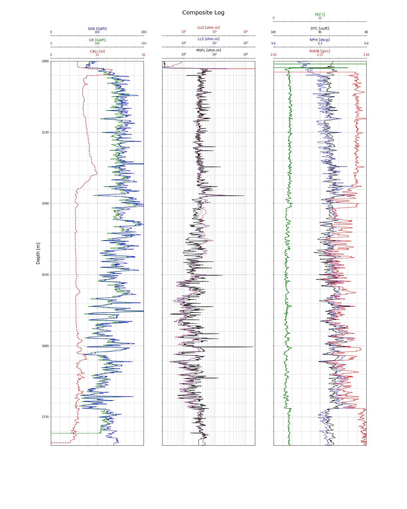

# wireline-log-plotting
Wireline Log Visualization/Plotting with Matplotlib in Python with LAS file as input

Written in Jupyter Notebook

Requirements:

```lasio==0.23```

```matplotlib==3.0.2```

```numpy==1.17.2```


Output:



Credit to https://github.com/petroGG/Basic-Well-Log-Interpretation
